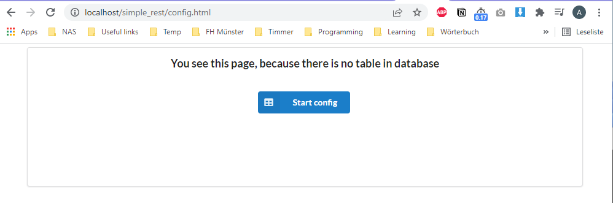

# A simple RESTful API

# Description:
* This project is a simple RESTful API with CRUD functions.
* After you installed the App using instructions below, the first time that you open the App in your browser, it will redirect you to the config page, because there is no table in database yet and so there are no data available to show as a table in the App.
* In condig page you have to click on **Start config** button and it will automatically create the table and insert the data from JSON file in ```/config/json/data.json``` into the database.
* You can open the config page any time you want and reset the data by clicking on **Start config** button.

# Demo
you can see a Demo version of the App hier [here](https://ordikhani.000webhostapp.com/) and the config page  [here](https://ordikhani.000webhostapp.com/config.html)

# Installation
### For using this App you need to have the following programs installed:
* A Webserver like Apache
* PHP7 or later
* MySQL or MariaDB

### For Windows
 * Windows users can easily install and use the XAMPP program.

 You can find the latest version from [here](https://www.apachefriends.org/de/index.html)

 After downloading and installing the XAMPP you will have a folder called xampp in your C: drive.

 Copy the whole files downloaded from this repository to C:\xampp\htdocs\simple_rest\

 **Setup the Database:**
 Before we start to setup the databse, we have to start the services for Apache and MySQL first.

 In order to do that you have to search for XAMPP Control Panel in you installed software on windows.

 Open the program and you will se something like this:

 

 You can start the services by clicking on start button in front of Apache and MySQL.

 If the services are successfuly started, it should look like this:


Next spep is to create a database for our application. Inorder to do that, click on the Admin button in front of the MySQL in XAMPP Control Panel.


By clicking the Admin button, the phpmyadmin program will be opened in your internet browser. Here you can manage your database.

Here click on new in irder to create a new database.


For database name please give "**sms_rest_db**" and in the filed in front of the input field for database name select "**utf8mb4_unicode_ci**" then click on create button. Now your new database should be in your database list in the left side.
* You can actually select any name you want for the database, but then you have to change the database name in code in config folder.


* Because I used the default username and password (username: 'root', password:''), so you don't need to create any username and password in this step.

* The table for this application will be automatically created by using the app.

* Now open your internet browser and go to http://localhost/simple_rest/. If you are opening this page for the first and because we didn't create any table yet, it will automatically be forwarded to the config page. and you will see this page:

 

* Now click on "**Start config**" button to create a table and also load the default data to the table automatically. If everything went allright you have to see this page.


* Now you can click on "**Show the table**" to start the application and enjoy it :D

---

### For Linux (Ubuntu 20.04)
#### Installing the packages

* First of all update the repository

```
sudo apt update
```

* Install Apache

```
sudo apt install apache2
```

* Confirm that Apache is now running with the following command:

```
sudo systemctl status apache2
```

* You should the get an output showing that the apache2.service is running and enabled.

```
● apache2.service - The Apache HTTP Server
     Loaded: loaded (/lib/systemd/system/apache2.service; enabled; vendor preset: enabled)
     Active: active (running) since Tue 2020-11-03 10:32:26 UTC; 1min 6s ago
       Docs: https://httpd.apache.org/docs/2.4/
   Main PID: 52943 (apache2)
      Tasks: 7 (limit: 2282)
     Memory: 11.9M
     CGroup: /system.slice/apache2.service
             ├─52943 /usr/sbin/apache2 -k start
             ├─52944 /usr/sbin/apache2 -k start
             ├─52945 /usr/sbin/apache2 -k start
             ├─52946 /usr/sbin/apache2 -k start
             ├─52947 /usr/sbin/apache2 -k start
             ├─52948 /usr/sbin/apache2 -k start
             └─52953 /usr/sbin/apache2 -k start*
```

* Once installed, test by accessing your server’s IP in your browser:

```
http://YOURSERVERIPADDRESS/
```

You should see a page with an “Apache2 Ubuntu Default” header showing that Apache2 has been installed successfully. If you do not see this, please ensure that the previous commands in this section have completed without error

### Installing and testing PHP 7.4:

```
sudo apt install php7.4 php7.4-mysql php-common php7.4-cli php7.4-json php7.4-common php7.4-opcache libapache2-mod-php7.4
```

* Check the installation and version:

```
php --version
```

* Restart Apache for the changes to take effect:

```
sudo systemctl restart apache2
```

### Installing MariaDB:

* Install the required packages:

```
sudo apt install mariadb-server mariadb-client
```

* Once installed, check it’s running correctly:

```
sudo systemctl status mariadb
```

You should see an output similar to the example below.

```
● mariadb.service - MariaDB 10.3.25 database server
     Loaded: loaded (/lib/systemd/system/mariadb.service; enabled; vendor preset: enabled)
     Active: active (running) since Tue 2020-11-03 10:33:12 UTC; 4s ago
       Docs: man:mysqld(8)
             https://mariadb.com/kb/en/library/systemd/
   Main PID: 53554 (mysqld)
     Status: "Taking your SQL requests now..."
      Tasks: 31 (limit: 2282)
     Memory: 65.9M
     CGroup: /system.slice/mariadb.service
             └─53554 /usr/sbin/mysqld
```

* Copy the project files and folders to:

```
/var/www/html/simple_rest/
```

### Setting up the Database:

* Login to the Database

```
sudo mysql -u root -p
```

* Get a list of all databases you have

```
SHOW DATABASES;
```

* Create a new database (sms_rest_db)

```
CREATE DATABASE sms_rest_db;
```

* Now you can exit the database using ``` exit ``` command

* Because I used the default username and password (username: 'root', password:''), so you don't need to create any username and password in this step.

* The table for this application will be automatically created by using the app.

* Now open your internet browser and go to http://localhost/simple_rest/. If you are opening this page for the first and because we didn't create any table yet, it will automatically be forwarded to the config page. and you will see this page:

 

* Now click on "**Start config**" button to create a table and also load the default data to the table automatically. If everything went allright you have to see this page.


* Now you can click on "**Show the table**" to start the application and enjoy it :D

---

# Testing the API using Postman

* You can test the API interface using [Postman](https://www.apachefriends.org/de/index.html)

### Getting all data

* Try this with GET method
```
http://localhost/simple_rest/api/cities/load_all_data.php
```

As the result you will get the whole data stored in database in JSON format

* Try this for giving the date range for the search with GET method
```
http://localhost/simple_rest/api/cities/load_data_from_to.php?dateFrom=1/1/2014&dateTo=1/1/2014
```

* Try this to insert the data from JSON file to database
```
http://localhost/simple_rest/api/cities/insert_json_in_db.php
```
As answer if everything gets well you will get ``` {"msg": "Done"} ``` as answer

* Try this to update a row in database. Please select **PUT** as method and in **Headers** add **Content-Type** and select **application/json**

 In **Body** tab select **raw** and for example give the following JSON in the box.
```
{
"city":"Berlin",
"start_date":"01/01/2022",
"end_date":"01/10/2022",
"price":"45.5",
"status":"Daily",
"color":"#ff0000",
"id":"5"
}
```

```
http://localhost/simple_rest/api/cities/update_data.php
```
 As response you have to get ```{"message":"Record Updated"}```

* Try this to delete a row in database. Please select **PUT** as method and in **Headers** add **Content-Type** and select **application/json**

In **Body** tab select **raw** and for example give the following JSON in the box.
```
{
"id":"7"
}
```

```
http://localhost/simple_rest/api/cities/delete_data.php
```

 As response you have to get ```{"message": "Record deleted"}```

 ---

# Dockerize the App

### Install the Docker

* First install the docker for your OS from [here](https://www.docker.com/get-started) and follow the instructions for every operating system.

* After the docker is installed open the termina in MacOS and Linux or command prompt ind windows and change the directory to **Docker files** folder in project folder.

### Run the Docker

* Now you can run the docker command like this:

```
docker-compose up
```

* Now the docker will download all the needed files and will run our App

* Now you can open your internet browser and type ``` http://localhost:8080/ ``` and you have to see the website running.

### Stop the Docker

* In order to stop the container you can  press ```ctrl+c``` to stop the service.

* If you want to delete and recreate the container you can run
```
docker-compose down
```
